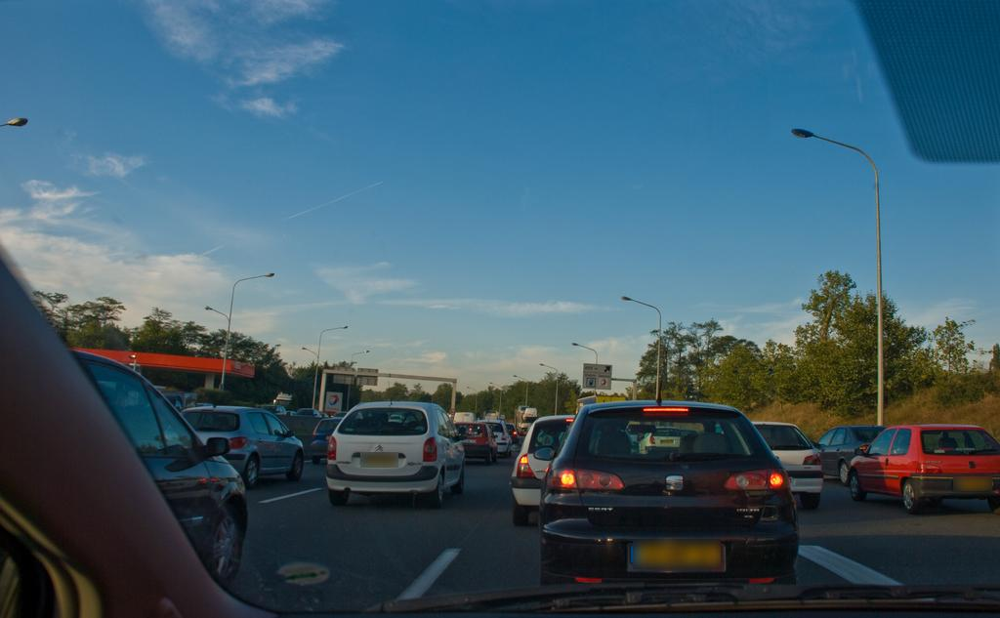

# Face Anonymization
This repo contains a simple image anonymization suite. It supports blurring faces, inpainting new faces using diffusion, and blurring license plates.


## How to use
- ``` pip install -r requirements.txt```
#### For face anonymization:
- to blur faces: ```python anonymize.py faces blur <path to your image>```
- to replaces faces: ```python anonymize.py faces inpaint <path to your image>```
#### For license plate anonymization:
- [train a license plate detection model](https://github.com/migueldecampos/license_plate_detection) and save model pickle file
- ```python anonymize.py license-plates <path to model pickle file> <path to your image>```

## Output

### Faces
Original Image:

Blurred Anonimization:

Inpainting Anonimization:


### License Plates
Original Image:

Blurred Anonimization:
