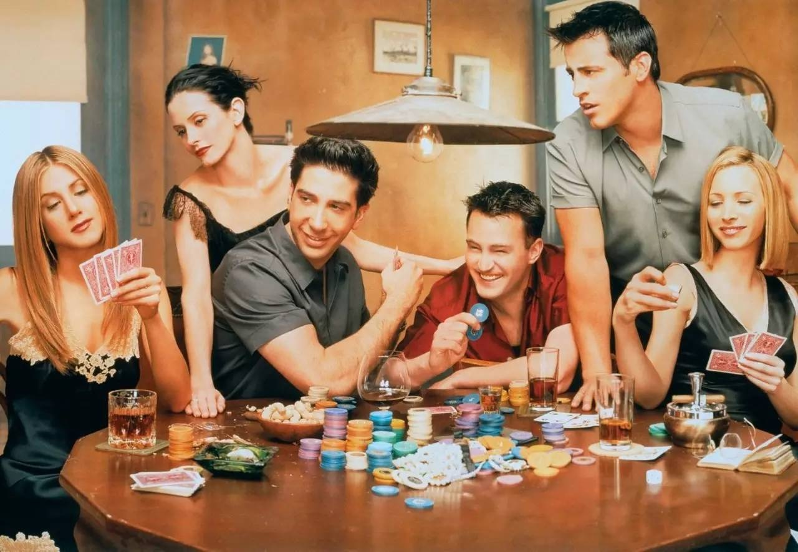
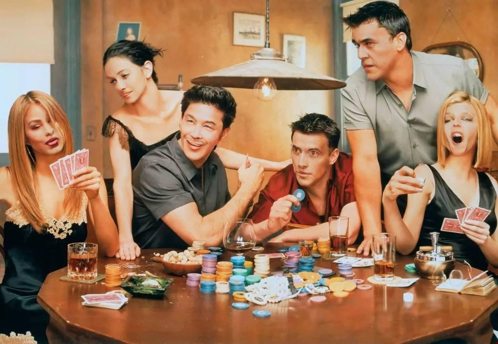

# Face Anonymization

This repo contains a simple image anonymization suite. It supports blurring including blurring of faces and inpainting of new faces using diffusion, as well as blurring of license plates.


## How to use
- ``` pip install -r requirements.txt```
- to blur faces: ```python anonymize.py blur <path to your image>```
- to replaces faces: ```python anonymize.py inpaint <path to your image>```


## Output
### Faces
Original Image:

Blurred Anonimization:

Inpainting Anonimization:

